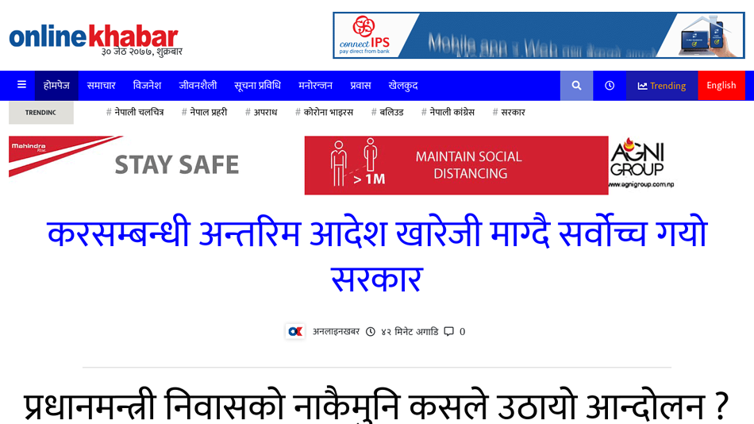

## Online Khabar Clone

> Online khabar is the No. 1 news portal from <b>Nepal</b>
>
> > This is a clone of news portal

> 🔗 "Online Khabar Clone" visit: <https://onlinekhabar.netlify.app/>

>    

## Preview of Homepage

> ## Contributing
>
> Pull requests are welcome. For major changes, please open an issue first to discuss what you would like to change.
